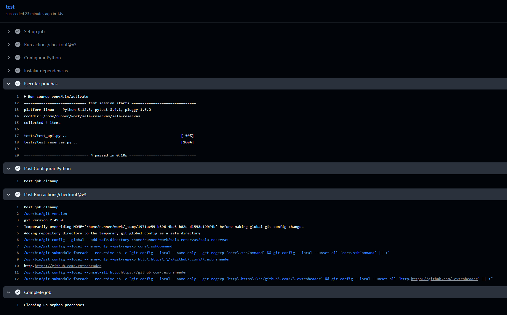

# Sala Reservas

## 📌 Descripción del proyecto

Sala Reservas es una aplicación web creada en Python para gestionar la reserva de salas por horario. Se incluye una API REST para gestionar nuevas reservas. Y el código de pruebas unitarias y de integración, para aplicar la automatización con GitHub Actions.

*Proyecto desarrollado como parte de un bootcamp de formación en herramientas DevOps, orientado a la práctica de integración continua y automatización de procesos con tecnologías estándar.*

---

## 📦 Herramientas utilizadas

- Python 3.10
- Flask
- Pytest
- Git & GitHub
- GitHub Actions (CI)

## ⚙️ Pasos realizados

- Verificación del entorno Python 3.10+.
- Creación de entorno virtual y estructura del proyecto.
- Creación de pruebas unitarias con `pytest` para lógica y API.
- Automatización del testing con workflows en GitHub Actions.

---

## ▶️ Comandos utilizados

### Creación del proyecto:
```bash
python --version
python -m venv venv
source venv/bin/activate
pip install -r requirements.txt
pytest
```

---

## 📁 Estructura del proyecto

```bash
sala-reservas/
├── app/
│   ├── __init__.py
│   ├── main.py
│   └── reservas.py
├── tests/
│   ├── test_reservas.py
│   └── test_api.py
├── requirements.txt
├── run.py
└── .github/
    └── workflows/
        └── testing.yml
```

## 🧪 Testing 

Las pruebas están implementadas con `pytest`, separadas por lógica de negocio `(test_reservas.py)` y API `(test_api.py)`.



---

## Preguntas finales

1. ¿En qué se diferencia Agile Testing del enfoque tradicional?

En Agile Testing se prueban los sistemas de forma continua e iterativa durante el desarrollo, no al final. Los testers trabajan junto al equipo desde el inicio, validando entregables pequeños, mientras que el enfoque tradicional espera al final del ciclo.

2. ¿Qué ventajas viste al usar TDD? ¿Qué te costó más?

TDD permitió definir mejor los requisitos desde el inicio y prevenir errores. Lo más desafiante fue diseñar los tests antes de implementar la lógica, pero resultó útil para mantener el enfoque y evitar sobrecodificación.

3. ¿Qué tipo de prueba crees que más valor aportó hoy?

Las pruebas de la API aportaron más valor, ya que validan el comportamiento real del sistema frente a entradas externas. Aseguran que la funcionalidad esté disponible como se espera para el cliente o frontend.

4. ¿Cómo mantendrías esta suite de pruebas con el tiempo?

Manteniendo una estructura clara de carpetas, automatizando las ejecuciones con GitHub Actions y aplicando TDD con nuevas funcionalidades. También revisando las pruebas con cada cambio o refactor para asegurar su vigencia.
